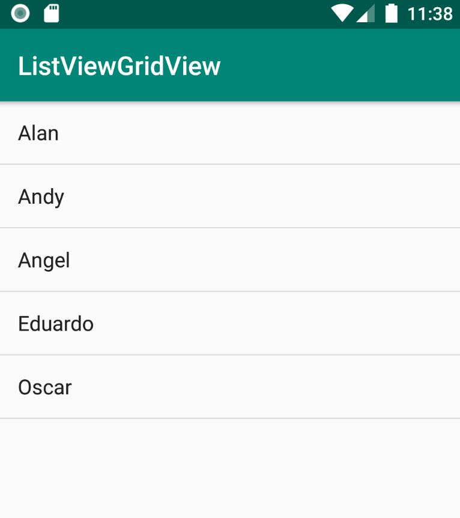
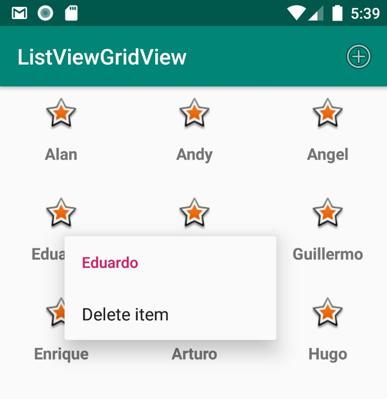

# ListView and Grid View

## ListView

```xml
    <ListView
        android:id="@+id/MainListView"
        android:layout_width="match_parent"
        android:layout_height="match_parent" />
```

Requiere de un Adapter para especificar como se mostrarán los datos.

```java
listView = findViewById(R.id.MainListView);

List<String> nameList = new ArrayList<String>();
nameList.add("Alan");
nameList.add("Andy");
nameList.add("Angel");
nameList.add("Eduardo");
nameList.add("Oscar");

ArrayAdapter<String> namesAdapter =
        new ArrayAdapter<String>(this,android.R.layout.simple_list_item_1,nameList);

listView.setAdapter(namesAdapter);
```



### Método Click en ListView

Implementar onItemClick:

```java
listView.setOnItemClickListener(new AdapterView.OnItemClickListener() {
    @Override
    public void onItemClick(AdapterView<?> adapterView, View view, int position, long id) {
        String name = nameList.get(position);
        Toast.makeText(MainActivity.this,name,Toast.LENGTH_SHORT).show();
    }
});
```

### Custom adapter

Creamos una clase que herede de BaseAdapter, implementamos los métodos de la interface y en el método GetView llena una vista con un layout y se asignan los datos a la vista.

```java 
public class MyAdapter extends BaseAdapter {

    private Context acitivityContext;

    private int layoutId;

    private List<String> nameList;


    public MyAdapter(Context context,int layout, List<String> names)
    {
        this.acitivityContext = context;
        this.layoutId = layout;
        this.nameList = names;
    }

    @Override
    public int getCount() {
        return this.nameList.size();
    }

    @Override
    public Object getItem(int position) {
        return this.nameList.get(position);
    }

    @Override
    public long getItemId(int id) {
        return id;
    }

    @Override
    public View getView(int position, View convertView, ViewGroup viewGroup) {

        //Fill view with item layout
        LayoutInflater layoutInflater = LayoutInflater.from(this.acitivityContext);
        View viewInflate = layoutInflater.inflate(R.layout.item_layout,null);

        //Set text by position to TextView
        String name = nameList.get(position);
        TextView nameTextView = viewInflate.findViewById(R.id.ItemTextView);
        nameTextView.setText(name);

        return viewInflate;
    }
}
```

```xml
<?xml version="1.0" encoding="utf-8"?>
<LinearLayout xmlns:android="http://schemas.android.com/apk/res/android"
    android:layout_width="match_parent"
    android:layout_height="wrap_content"
    android:background="#EFF0F1"
    android:orientation="horizontal"
    android:padding="20dp">

    <TextView
        android:id="@+id/ItemTextView"
        android:layout_width="wrap_content"
        android:layout_height="wrap_content"
        android:layout_gravity="center_vertical"
        android:layout_weight="1"
        android:textSize="20dp"
        android:textStyle="bold" />

    <ImageView
        android:layout_width="wrap_content"
        android:layout_height="wrap_content"
        android:layout_gravity="center_vertical"
        android:layout_marginLeft="20dp"
        android:src="@android:drawable/star_big_on" />

</LinearLayout>
```

### ViewHolder Pattern

```java
    @Override
    public View getView(int position, View convertView, ViewGroup viewGroup) {
        //View holder pattern
        ViewHolder holder;

        //First time renderer is null
        if(convertView == null){
            //Fill view with item layout
            LayoutInflater layoutInflater = LayoutInflater.from(this.acitivityContext);
            convertView = layoutInflater.inflate(this.layoutId,null);
            holder = new ViewHolder();

            //Save reference in holder
            holder.nameTextView = convertView.findViewById(R.id.ItemTextView);
            convertView.setTag(holder);
        }else{
            //For example when scroll is up, recover reference
            holder = (ViewHolder) convertView.getTag();
        }

        //Set text by position to TextView
        String name = nameList.get(position);
        holder.nameTextView.setText(name);

        return convertView;
    }

    private static class ViewHolder {
        private TextView nameTextView;
    }
```

### GridView

Un GridView soporta adaptadores igual que un ListView, así que sería la misma forma de implementarlo

## Implementar Option menu y Context menu

Se puede aplicar el context menu para cualquier elemento, en este ejemplo se realiza en un GridView

```java
    /**
     * Set add layout to menu
     * @param menu Menu
     * @return is success
     */
    @Override
    public boolean onCreateOptionsMenu(Menu menu) {
        MenuInflater menuInflater = getMenuInflater();
        menuInflater.inflate(R.menu.action_bar_menu,menu);
        return true;
    }

    /**
     * Add item to name list
     * @param item Menu item
     * @return Is success
     */
    @Override
    public boolean onOptionsItemSelected(MenuItem item) {

        switch (item.getItemId()){
            case R.id.addItem:
                this.nameList.add("Added "+(++counter));

                //Notify to adapter that data source changed
                this.myAdapter.notifyDataSetChanged();
                return true;
            default:
                return super.onOptionsItemSelected(item);
        }
    }

    /**
     * Set remove layout to menu
     * @param menu Context menu
     * @param v View
     * @param menuInfo menu info
     */
    @Override
    public void onCreateContextMenu(ContextMenu menu, View v, ContextMenu.ContextMenuInfo menuInfo) {
        super.onCreateContextMenu(menu,v,menuInfo);

        //Set title
        AdapterView.AdapterContextMenuInfo info =
                (AdapterView.AdapterContextMenuInfo)menuInfo;

        menu.setHeaderTitle(this.nameList.get(info.position));

        //Set layout
        MenuInflater menuInflater = getMenuInflater();
        menuInflater.inflate(R.menu.context_menu,menu);
    }

    /**
     * Remove name from list
     * @param item Menu item
     * @return Is success
     */
    @Override
    public boolean onContextItemSelected(MenuItem item) {

        //Get item info
        AdapterView.AdapterContextMenuInfo info =
                (AdapterView.AdapterContextMenuInfo)item.getMenuInfo();

        switch (item.getItemId()){
            case R.id.delete_item:
                this.nameList.remove(info.position);

                //Notify to adapter that data source changed
                this.myAdapter.notifyDataSetChanged();
                return true;
            default:
                return super.onContextItemSelected(item);
        }
    }
```

**NOTA:** Es importante registrar la vista que tendra el Context Menu en el método **OnCreate()** de la siguiente forma **registerForContextMenu(this.gridView);**.

